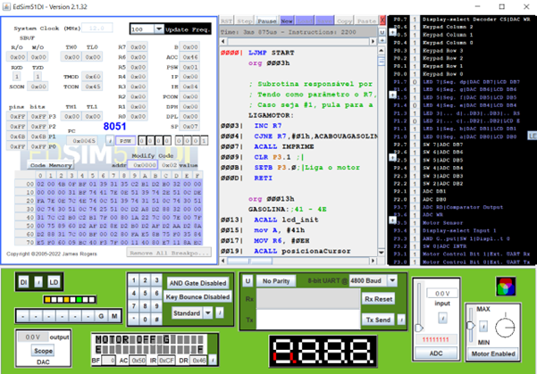
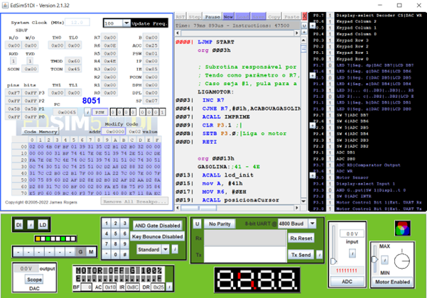
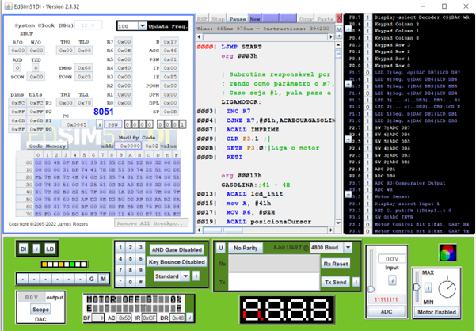

# Engine-Simulator-with-Fillable-Gas-Tank

## ℹ️ Description

Engine simulator with fillable gas tank made with Assembly language and Edsim 8051 system. 

Engine information appears on the display, it is possible to adjust the power of the project engine using the Edsim51 engine itself and buttons 0 and 1 (renamed to M and G, respectively) are used for M - start the engine, G - fuel the tank.

## 👁️‍🗨️ Preview 

  

Img 01. When pressing 'run', the display turns on showing the tank with 0% of gasoline.

  

Img 02. By pressing the 'G' button, the tank is filled and the display shows 100%.

  

Img 03. When pressing 'M' the engine starts working, updating the display from 100% to 75%, 50%, 25% until reaching 0%.

  

Img 04. When the gasoline runs out, the engine stops and the display shows 0%.

## 🛠️ **Technologies**

&nbsp;
